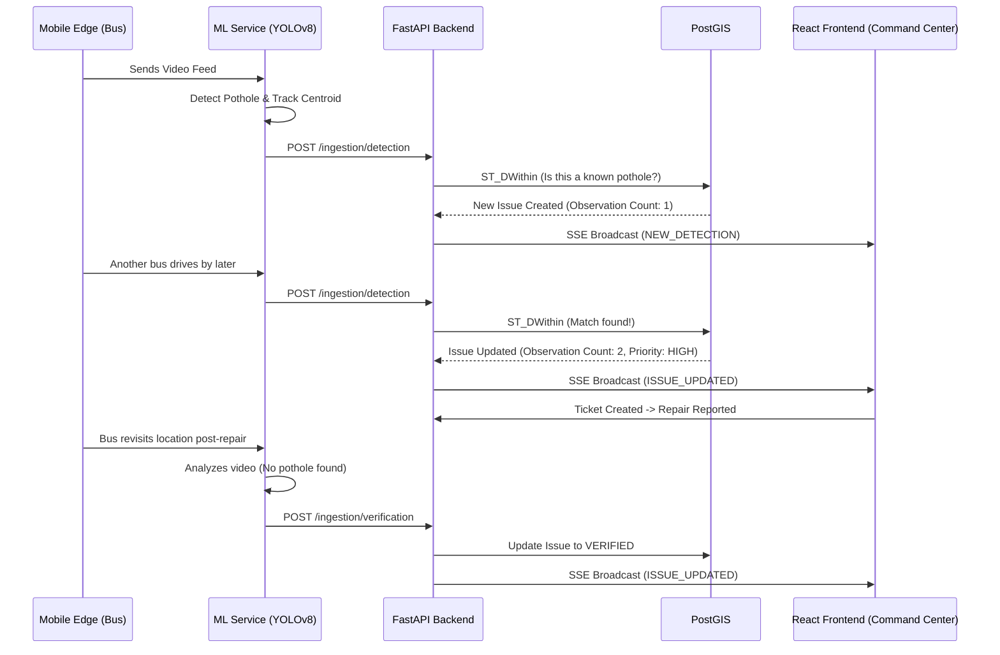

# Architecture Overview
AI-powered Mobile Urban Intelligence Network

## The Closed-Loop Verification Pipeline

The system is designed not just to detect potholes, but to track their entire lifecycle and physically verify their repair using the same AI logic.

## Tech Stack
- **Edge ML**: Python, Ultralytics YOLOv8, OpenCV, Centroid Tracker
- **Backend API**: Python, FastAPI, SQLAlchemy (Async), Uvicorn
- **Spatial DB**: PostgreSQL 15 + PostGIS
- **Real-Time**: Server-Sent Events (SSE) via `sse-starlette`
- **Frontend**: React 18, Vite, TypeScript, Radix UI, TailwindCSS
- **Deployment**: Docker Compose

## Hardened Demo Resilience
The repository is optimized for a zero-downtime, deterministic SIH demo presentation. 
The database can be reliably reset via `python backend/scripts/reset_demo_data.py`. 
Frontend queries gracefully degrade via strict ErrorBoundaries and safe numerical formatters avoiding `NaN`.
