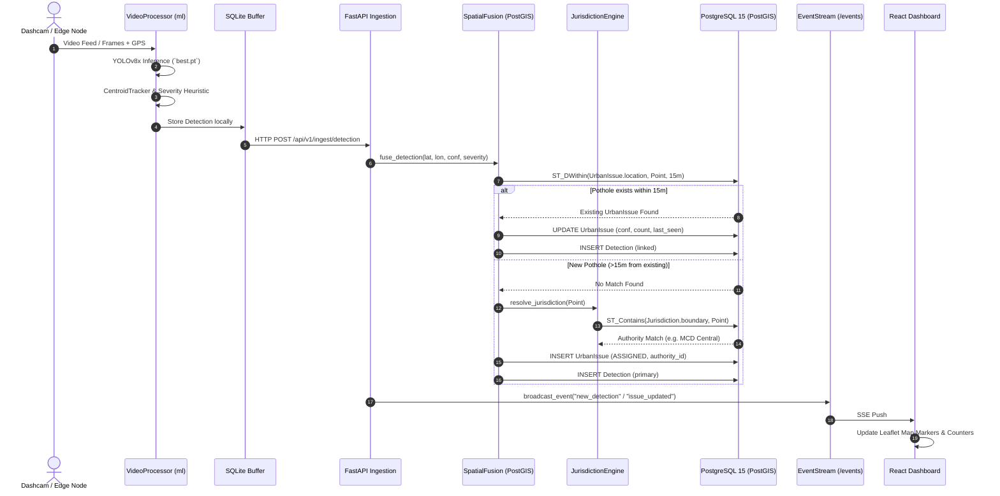

# PHASE 0 — SYSTEM ARCHITECTURE & TOPOLOGY AUDIT
**Project:** POTHOLE WALA — Infrastructure Intelligence Network  
**Audit Date:** September 2026  
**Auditor Roles:** Senior Principal Software Architect, PostGIS Engineer, Backend Systems Architect  
**Scope:** Component topologies, data pipelines, layer-by-layer inspection, and intended-vs-actual implementation deltas.

---

## 1. Subsystem Architecture Overview

POTHOLE WALA is structured as a distributed edge-to-cloud infrastructure monitoring platform. The architecture decomposes into 5 functional tiers:

```
[ Edge Devices / Buses / Dashcams ]
               │
               ▼ (Video MP4 / RTSP Stream + GPS)
┌──────────────────────────────────────────────────────────┐
│  Tier 1: Edge & Ingestion Pipeline (Python / OpenCV)      │
│  - VideoProcessor (`ml/pipeline/video_processor.py`)     │
│  - YOLOv8 Inference (`ml/engine/detector.py`, best.pt)   │
│  - Centroid Tracker (`ml/engine/tracker.py`)             │
│  - 2D Severity Heuristic (`ml/engine/severity.py`)       │
│  - SQLite Offline Buffer & Sync (`ml/pipeline/client.py`)│
└──────────────────────────────┬───────────────────────────┘
                               │ HTTP POST /api/v1/ingest/detection
                               ▼
┌──────────────────────────────────────────────────────────┐
│  Tier 2: API Gateway & Application Server (FastAPI)       │
│  - Main App & CORS (`backend/app/main.py`)               │
│  - 11 Domain Routers (`backend/app/api/v1/*.py`)         │
│  - Async SQLAlchemy 2.0 Engine & Sessionmaker            │
└──────────────────────────────┬───────────────────────────┘
                               │
               ┌───────────────┴───────────────┐
               ▼                               ▼
┌───────────────────────────────┐ ┌───────────────────────────────┐
│ Tier 3: Spatial & Core Engine │ │ Tier 4: Storage & Persistence │
│ - Spatial Fusion (15m buffer) │ │ - PostgreSQL 15 + PostGIS 3.3 │
│ - Jurisdiction Engine (Poly)  │ │   (`aih-pothole-db-1:5432`)   │
│ - Ticket Lifecycle Engine     │ │ - Redis 7 (`redis-1:6379`)    │
│ - Road Health & Linker Engine │ │   (Present but UNUSED)        │
│ - Repair Verification Engine  │ │ - Upload Storage Volume       │
└───────────────────────────────┘ └───────────────────────────────┘
                               │
                               ▼ SSE Stream / REST JSON
┌──────────────────────────────────────────────────────────┐
│  Tier 5: Presentation & Dashboard (React 19 + Vite)      │
│  - Leaflet Map & PostGIS GeoJSON Layer Rendering         │
│  - Authority Management, Work Orders & Verification UI   │
│  - Realtime SSE Listener (`realtime.ts`)                 │
└──────────────────────────────────────────────────────────┘
```

---

## 2. Layer-by-Layer Detailed Analysis

### Layer 1: Edge & Ingestion Pipeline
- **Files:** `ml/pipeline/video_processor.py`, `ml/engine/detector.py`, `ml/engine/tracker.py`, `ml/engine/severity.py`, `ml/pipeline/client.py`, `ml/pipeline/gps_simulator.py`.
- **Functionality:**
  - `VideoProcessor.process()` opens video streams using OpenCV `cv2.VideoCapture`.
  - Runs YOLOv8 object detection on downscaled/raw frames.
  - Matches bounding boxes across frames using `CentroidTracker` (Euclidean distance threshold: 50 pixels, max disappearance: 30 frames).
  - Calculates severity using 2D box-area ratio (`severity.py:17`).
  - Calls `BackendClient.send_detection()` which writes locally to an offline SQLite database (`events_buffer.db`) before attempting HTTP POST to the backend.
- **Transcoding & Video Output:**
  - Draws bounding boxes, confidence, class names, and tracking IDs onto frames.
  - Writes annotated frames to `.mp4v` codec file.
  - Invokes `ffmpeg` subprocess to re-encode to browser-compatible H.264 (`video_processor.py:257-297`).
  - *Defect Identified:* Windows host lacks `ffmpeg` in PATH; raises `RuntimeError` on local runs outside Docker.

### Layer 2: API Gateway & Application Server
- **Files:** `backend/app/main.py`, `backend/app/api/v1/*.py`.
- **Functionality:**
  - FastAPI ASGI application configured with CORS middleware.
  - 11 domain routers exposing 28+ endpoints:
    - `/issues`: Urban issue spatial queries, details, audit logs.
    - `/tickets`: Work orders, status transitions, priority routing.
    - `/verifications`: Repair verification submissions, before/after comparisons.
    - `/analytics`: Spatial health aggregates, authority performance, hexbins.
    - `/fleet`: Vehicle telematics, mock bus locations, route tracks.
    - `/inspections`: Video upload handler, job polling, annotated stream delivery.
    - `/ingest`: Raw detection ingestion from edge nodes.
    - `/authorities`: PWD, MCD, and Noida authority registries.
    - `/complaints`: Citizen reporting and spatial auto-linking.
    - `/simulator`: Edge device simulation triggers.
    - `/events`: Server-Sent Events (SSE) push stream.
- **Defect Identified:** Zero endpoints enforce authentication. All data operations are publicly accessible without JWT or API key verification.

### Layer 3: Spatial Fusion & Business Logic
- **Files:** `backend/app/services/*.py`.
- **Core Algorithms:**
  1. `SpatialFusionService.fuse_detection()` (`spatial_fusion.py:27-104`):
     - Takes incoming point `(longitude, latitude)`.
     - Executes PostGIS query: `func.ST_DWithin(func.Geography(UrbanIssue.location), func.Geography(func.ST_GeomFromText(point_wkt, 4326)), 15.0)`.
     - If an existing issue is found within 15 meters:
       - Increments `detection_count`.
       - Updates `last_seen_at`.
       - Recalculates running average confidence: `new_conf = ((old_conf * count) + curr_conf) / (count + 1)`.
       - Creates a linked `Detection` entity.
     - If no issue is found within 15 meters:
       - Evaluates jurisdiction via `JurisdictionEngine`.
       - Links to nearest road segment via `RoadSegmentLinker`.
       - Creates new `UrbanIssue` in database.
  2. `JurisdictionEngine.resolve_jurisdiction()` (`jurisdiction_engine.py:32-72`):
     - Priority 1: If `road_segment.authority_id` is set, assign immediately.
     - Priority 2: Execute PostGIS `func.ST_Contains(Jurisdiction.boundary, point)`. Matches Delhi PWD, MCD Central, or Noida Urban.
     - Priority 3: Set status to `unresolved` and block ticket creation.
  3. `TicketLifecycleService` (`ticket_lifecycle.py:35-125`):
     - Calculates dynamic priority score based on `severity * 0.4 + traffic_impact * 0.3 + complaint_count * 0.3`.
     - Automatically sets SLA due dates (Critical: 24h, High: 48h, Medium: 7 days, Low: 14 days).

### Layer 4: Persistence & Storage
- **Components:**
  - PostgreSQL 15 with PostGIS 3.3 extension running in container `aih-pothole-db-1` (mapped to host port 5433).
  - Alembic database migration chain: 9 revisions (`0001_initial_schema` to `0009_jurisdiction_authority`).
  - Spatial types: `geometry(Point, 4326)` for `UrbanIssue.location`, `geometry(LineString, 4326)` for `RoadSegment.geometry`, `geometry(Polygon, 4326)` for `Jurisdiction.boundary`.
  - Redis 7 container running on port 6379 (currently idle/disconnected).
  - Docker volume `backend_uploads` mounted at `/app/uploads` in backend container.

### Layer 5: Presentation & Frontend
- **Framework:** React 19.2.8, Vite 8.2.2, TailwindCSS v4, React Router v7, Leaflet 1.9.4.
- **Pages:** 18 page components in `frontend/src/pages/`.
- **Realtime Integration:** EventSource connection to `/api/v1/events` invalidating React state on incoming detection events.

---

## 3. End-to-End Data Pipeline Flow



---

## 4. Intended Architecture vs Actual Implementation Delta

| Architectural Aspect | Intended / Advertised Design | Actual Repository Implementation | Delta & Risk |
|---|---|---|---|
| **Realtime Pub/Sub** | Redis Pub/Sub backend with Redis 7 container | In-memory Python `set()` of `asyncio.Queue` in `events.py` | High: Fails across multi-process or clustered backends. Redis container wastes resources. |
| **Authentication / RBAC** | JWT Auth with Role-Based Access (Citizen, Contractor, Authority Admin) | `core/security.py` has uninvoked helper functions; zero route guards | Critical: Any user has complete unauthenticated read/write/delete access. |
| **Spatial Indexing** | Fast GiST index lookups on spatial location points | PostGIS query wraps column in `func.Geography()` without functional index | High: GiST index on `geometry` is bypassed; table undergoes sequential scan per frame. |
| **Defect Classification** | Multi-class damage model (potholes, cracks, rutting, alligator) | YOLOv8 weights file `best.pt` has strictly 1 class: `{0: 'pothole'}` | Medium: UI claims of crack detection are unsupported by neural network. |
| **Depth / Severity** | 3D Depth estimation / volumetric analysis | Monocular 2D bounding box to frame area ratio (`severity.py`) | Medium: Highly susceptible to camera distance perspective distortion. |
| **Video Annotation** | Direct browser video streaming of processed inspection runs | OpenCV `.mp4v` writer requiring host `ffmpeg` CLI transcoding | Critical: Video processor crashes on local Windows hosts lacking ffmpeg. |
| **Frontend Map Routing** | Dedicated `LiveMap` and `Intelligence` views | `LiveMap.tsx` is an exact 100% duplicate clone of `Intelligence.tsx` | Low: Dead code and routing confusion. |
| **Search & Navigation** | Global search across live issues, road segments, and tickets | Hardcoded mock search results in `CommandPalette.tsx` linking to 404s | High: Immediate bad impression if tested by jury. |
